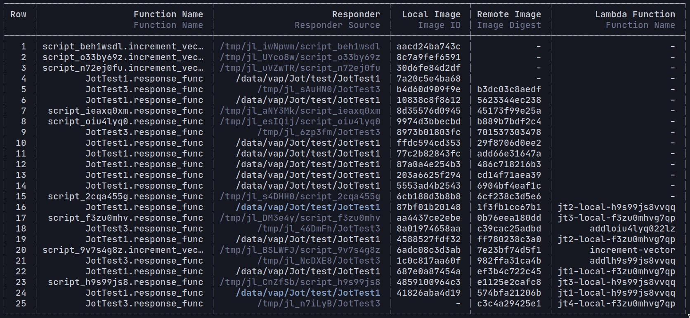

# Managing Lambda Functions using Jot

Jot.jl can be used to inventory and manage existing lambda functions. Local docker images, remote docker images (hosted on AWS ECR), and AWS-hosted Lambda functions that share identical underlying code are grouped together into `LambdaComponents` objects. Whether two pieces of code are identical or not is determined by finding their [Git tree hash](https://github.com/JuliaLang/Pkg.jl/blob/master/src/GitTools.jl). This provides a reliable way to distinguish between, for example, two local docker images created via Jot.jl that may share the same name, `Project.toml`, version and git commit, but where the underlying code was tweaked between the creation of the two images. A `LambdaComponents` struct groups together objects that have identical function code.

The `show_lambdas()` function organizes local images, remote images and lambda functions into `LambdaComponents` and displays it:

The Responder column is colour-coded:
- Grey indicates that, if a local file-path, the path no longer exists.
- White indicates that the Responder path still exists.
- Blue indicates not just that the resource used to create the function still exists, but also that it contains underlying code which matches this `LambdaComponents`.

